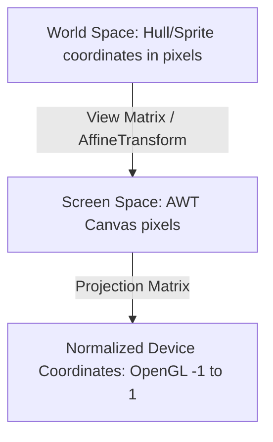

# Starsector Ship Editor - OpenGL Rendering Migration & Architecture Guide

This comprehensive document compiles the architecture analysis, coordinate mathematics, implementation plans, completed changes, and verification results for the migration of the Starsector Ship Editor from its legacy Java2D pipeline to the modern LWJGL (OpenGL 3.3 Core Profile) pipeline.

---

## 1. Core Rendering Architecture

The Starsector Ship Editor uses **LWJGL 3** in a core profile (OpenGL 3.3) environment embedded within a **Swing/AWT** interface. Below is a breakdown of how sprites and UI elements are rendered.

### A. Context and Container (`PrimaryViewer.java`)
The rendering context is hosted inside `PrimaryViewer`—a Swing `JPanel` that contains an `AWTGLCanvas` (from `lwjgl3-awt`). This bridges modern OpenGL rendering with the standard Swing UI framework.

- **Initialization**: `PrimaryViewer` sets up the `AWTGLCanvas` requesting OpenGL 3.3 Core Profile with 4x Anti-Aliasing.
- **Render Loop**: The `paintGL()` method is the main render loop. It is triggered by Swing repaints. It updates the viewport, clears the buffers, calculates the orthographic projection matrix using JOML (`org.joml.Matrix4f`), and delegates the actual drawing calls to `PaintOrderController`.

### B. Rendering Orchestration (`PaintOrderController.java`)
`PaintOrderController` implements the `OpenGLPainter` interface and defines the painter's algorithm (draw order) to ensure elements overlap correctly. 

It executes drawing in the following order:
1. **Background**: Checkerboard pattern drawn using `ShapeRenderer`.
2. **Axes**: The main X/Y grid axes.
3. **Ship/Weapon Layers**: Iterates through `LayerManager` and draws each `ViewerLayer` (including their sprites and point painters).
4. **Layer-dependent Guides**: Borders, center markers, and cursor guides for the currently selected layer.
5. **Misc Points**: Miscellaneous overlay points.
6. **Dragged Objects**: Renders ghostly outlines of items currently being dragged onto the canvas.
7. **Hotkey Help**: Overlays shortcut information.

A 60FPS (~16ms) Swing Timer runs inside `PaintOrderController` which checks for a `repaintQueued` flag and triggers `parent.repaint()`, preventing continuous redrawing unless there are changes.

### C. Sprite Rendering (`SpriteRenderer.java`)
`SpriteRenderer` is a specialized class optimized for rendering Starsector ship hulls, weapons, and projectiles as textured 2D quads.

- **Shaders**: Uses a custom GLSL 330 core shader program. The vertex shader computes `gl_Position = projection * view * model * vec4(vertex.xy, 0.0, 1.0)`. The fragment shader multiplies the texture sample by a tint color.
- **Buffers**: A single static VAO and VBO are initialized once with the vertex positions and UV coordinates of a 1x1 quad. 
- **Drawing (`drawSprite`)**: 
  - Constructs a `model` Matrix4f.
  - Translates to the target position.
  - Shifts the origin to the center of the sprite, applies rotation, and translates back to support rotation around the center.
  - Scales the quad to the sprite's dimensions.
  - Binds the texture and draws the quad using `GL_TRIANGLES`.

### D. UI and Geometric Rendering (`ShapeRenderer.java`)
`ShapeRenderer` is used for untextured geometry such as grid lines, bounding boxes, overlay circles, and UI hints.

- **Shaders**: A separate GLSL 330 core shader program that receives a `shapeColor` uniform instead of a texture sampler.
- **Dynamic Buffers**: Initializes a VAO and a VBO with `GL_DYNAMIC_DRAW` (1024 floats).
- **Batching System (`begin`/`end`)**: Implements a `begin(projection, view)` and `end()` block.
- **Drawing Primitives**:
  - `drawLine`: Updates the VBO with start/end points using `glBufferSubData` and draws `GL_LINES`.
  - `drawRect`: Generates vertices for either a filled quad (`GL_TRIANGLES`) or an outline (`GL_LINE_LOOP`).
  - `drawCircle`: Computes vertices using trig functions (32 segments) and handles dynamic buffer reallocation using `MemoryUtil.memAllocFloat` if the vertex array exceeds the initial buffer size.

---

## 2. Coordinate Systems & Transformation Math

The application maps coordinate spaces across three domains: **World Space**, **Screen Space**, and **Normalized Device Coordinates (NDC)**.



### A. Viewport and Projection Mapping
In OpenGL, Normalized Device Coordinates (NDC) range from `[-1, -1]` (bottom-left) to `[1, 1]` (top-right). 
To align OpenGL with the AWT/Swing coordinate system where `(0,0)` is the top-left and $Y$ increases downwards, `PrimaryViewer` sets up an orthographic projection matrix:

```java
projectionMatrix.setOrtho(0.0f, getWidth(), getHeight(), 0.0f, -1.0f, 1.0f);
```

This orthographic projection maps:
- `Left = 0.0f` $\rightarrow$ NDC $X = -1$
- `Right = width` $\rightarrow$ NDC $X = 1$
- `Bottom = height` $\rightarrow$ NDC $Y = -1$
- `Top = 0.0f` $\rightarrow$ NDC $Y = 1$

This allows rendering commands to be issued directly in **Screen Space (pixels)**.

### B. World-to-Screen Mapping: `AffineTransform` to `Matrix4f`
The camera translation, zoom, and orientation are tracked in `ViewerTransform` using a standard Java2D `AffineTransform`:
$$x_{screen} = m_{00} \cdot x_{world} + m_{01} \cdot y_{world} + m_{02}$$
$$y_{screen} = m_{10} \cdot x_{world} + m_{11} \cdot y_{world} + m_{12}$$

This 2D transform is represented as a 4x4 matrix in column-major JOML notation. The conversion function in `ViewerTransform.java` maps the parameters to the JOML row-major constructor:

```java
public static Matrix4f convertToMatrix4f(AffineTransform at) {
    double[] matrix = new double[6];
    at.getMatrix(matrix);
    float m00 = (float) matrix[0];
    float m10 = (float) matrix[1];
    float m01 = (float) matrix[2];
    float m11 = (float) matrix[3];
    float m02 = (float) matrix[4];
    float m12 = (float) matrix[5];

    return new Matrix4f(
        m00, m10, 0f, 0f,   // Col 0
        m01, m11, 0f, 0f,   // Col 1
        0f,  0f,  1f, 0f,   // Col 2
        m02, m12, 0f, 1f    // Col 3
    );
}
```
*Note: Because JOML’s 16-argument constructor interprets arguments in column-major order (`m<column><row>`), this mapping correctly assigns translations $m_{02}$ and $m_{12}$ to column 3, preventing perspective division errors.*

### C. Rotation Anchors
To rotate a sprite around an arbitrary rotation anchor in World Space, the transformation sequence must be:
1. Translate to the rotation anchor: $T(rot_x, rot_y, 0)$
2. Rotate around the $Z$-axis: $R(\theta)$
3. Translate back from the rotation anchor: $T(-rot_x, -rot_y, 0)$
4. Translate to the sprite anchor position: $T(anchor_x, anchor_y, 0)$
5. Scale to the sprite's dimensions: $S(w, h, 1)$

This evaluates to the composite model matrix:
$$M = T(rot) \cdot R(\theta) \cdot T(anchor - rot) \cdot S(size)$$

```java
Matrix4f model = new Matrix4f();
model.translate(rotationAnchor.x, rotationAnchor.y, 0.0f);
model.rotate(rotationRadians, new Vector3f(0.0f, 0.0f, 1.0f));
model.translate(anchor.x - rotationAnchor.x, anchor.y - rotationAnchor.y, 0.0f);
model.scale(size.x, size.y, 1.0f);
```

### D. Texture Caching & The OpenGL Lifecycle
To prevent reloading textures on every frame (which would saturate PCIe bandwidth and drop frame rates), `Sprite` or `LayerPainter` must cache the OpenGL texture ID.
When `AWTGLCanvas.initGL()` is called, we prepare to load these textures into memory.
If a sprite is swapped or garbage-collected, the corresponding texture ID must be deleted using `GL11.glDeleteTextures(textureID)` to avoid GPU memory leaks.

---

## 3. Migration Implementation Plan

This section summarizes the key code modifications planned (and subsequently completed) during the OpenGL migration process.

### A. Sprite & Texture Management (`Sprite.java`)
- Add a new private field `private int textureId = 0;` (0 represents unbound/unloaded in OpenGL).
- Expose a thread-safe getter method `public int getTextureId()`:
  - If `textureId == 0` and `image != null`, load it by calling `TextureLoader.loadTexture(image)` and cache the returned ID.
  - Return `textureId`.
- Add a clean-up method `public void cleanup()`:
  - If `textureId != 0`, call `GL11.glDeleteTextures(textureId)` and set `textureId = 0`.

### B. Sprite Renderer Overloads (`SpriteRenderer.java`)
- Add a new overloaded `drawSprite` method that supports a custom rotation anchor in World Space:
  ```java
  public void drawSprite(int textureID, Vector2f position, Vector2f size, 
                         Vector2f rotationAnchor, float rotationRadians, 
                         Vector4f color, Matrix4f projection, Matrix4f view);
  ```
- Delegate the legacy quad-centered `drawSprite` to this new method.

### C. Layer Painters (`LayerPainter.java` & `ShipPainter.java`)
- Rewrite `paint()` and `paintContent()` to use OpenGL `SpriteRenderer` with dynamic texture IDs, rotation, opacity, and matrices.
- Remove deprecated local AWT variables and call `super.paint` to trigger GL-based sprite drawing.

### D. Point Painters & Entities
- **`AbstractPointPainter.java` / `BoundPointsPainter.java`**: Bind `shapeRenderer.begin` in screen space (identity view matrix) to ensure constant size of coordinate dots, then iterate through point delegates.
- **`BaseWorldPoint.java` / `BoundPoint.java`**: Draw screen-space outline and inner colored circles using `ShapeRenderer`.
- **`ShieldCenterPoint.java` / `ShipCenterPoint.java`**: Temporarily suspend screen-space rendering, draw world-space bounds/shield rings, and resume screen-space rendering for coordinate overlays.
- **`EnginePoint.java`**: Use `ShapeRenderer` with a rotated view matrix to draw sizing rectangles and `SpriteRenderer` with custom anchors to draw flame sprites.

### E. Weapon Slots Rendering (`SlotDrawer.java` & `WeaponSlotPoint.java`)
- Compose a model matrix `Translate(screenPos) * Rotate(transformedAngle)` to render slot shapes (circle, square, triangle, arc outline) in local screen space.

### F. Installed Features & Viewport Centering
- **`InstalledFeaturePainter.java` / `InstalledFeature.java`**: Forward GL matrices and draw fitted weapons, built-ins, and modules by delegating directly to the features' painters.
- **`PrimaryViewer.java`**: Automatically trigger `centerViewpoint()` once layout dimensions are non-zero upon loading layers.

---

## 4. Completed Changes & Migration Walkthrough

The rendering pipeline has been fully migrated. Direct usage of AWT `Graphics2D` on the rendering canvas has been eliminated.

### A. Engine & Preview Slot Rendering
- **`EngineSlotPainter.java`**: Migrated `paintPainterContent` to OpenGL. Added caching of preview engine flame textures.
- **`EnginePoint.java`**: Purged the unused legacy static `drawAction` and inner class `EngineDrawAction`. Replaced with static GL helpers utilizing the base flame core texture.

### B. Weapon Slots & Launch Bays
- **`SlotDrawer.java`**: Re-implemented all shape/arc drawing helpers using OpenGL. Outlines remain crisp and visible through dynamic min-size limits.
- **`WeaponSlotPoint.java` / `LaunchPortPoint.java` / `WeaponSlotPainter.java`**: Shifted execution to OpenGL-based screen-space batches.

### C. Installed Features & Viewport Centering
- **`InstalledFeaturePainter.java` / `InstalledFeature.java`**: Restored fitted weapon and module overlays using rotated GL model matrices.
- **`PrimaryViewer.java`**: Corrected viewport centering timing on layer load once panel sizes are non-zero.

### D. Compilation Fixes
- **`BoundPointsPainter.java` / `ShipCenterPoint.java`**: Fixed missing OpenGL imports and typed color parameters to allow extraction of components for uniform binding.

### E. Dragged Preview & Text Rendering
- **`DraggedObjectsPainter.java` / `DrawUtilities.java`**: Implemented a screen-space dynamic cached text texture system (`TextTexture`) created from AWT Font outlines, enabling high-performance text rendering without re-uploading textures.
- **`ShipCSVEntry.java` / `WeaponCSVEntry.java`**: Refactored entry painting to delegate to `DrawUtilities.paintInstallableGhostGL` at 0.5f opacity.

### F. Center Point Painter, Weapon Painter, and Projectiles
- **`CenterPointPainter.java`**: Migrated perpendicular cross drawing to `ShapeRenderer` lines and coordinates to screen-space `drawTextGL`.
- **`WeaponPainter.java` / `ProjectilePainter.java` / `ProjectileLayerPainter.java`**: Migrated part drawing, missile layers, and projectile animations to `SpriteRenderer` texture draws.
- **`OffsetPoint.java` / `WeaponOffsetPainter.java`**: Migrated directional line rendering to `ShapeRenderer.drawLine` (with black outline and white inner core).

### G. Shortcut Guides & Hotkey Help
- **`HotkeyHelpPainter.java`**: Replaced the legacy `Graphics2D.drawImage` call with modern `SpriteRenderer.drawSprite(...)` using on-demand texture generation. This resolved the runtime `NullPointerException` crash under the GL canvas.

---

## 5. Verification Results

- **Automated Tests**: Clean compilation completed successfully with a **BUILD SUCCESS** status.
- **Runtime Verification**: The editor was launched directly via Java classpath execution mapping to the hardware GPU (`/dev/dri/card0`). The editor initializes properly, creates the unmapped X11 window, and runs completely idle waiting for UI input events.
